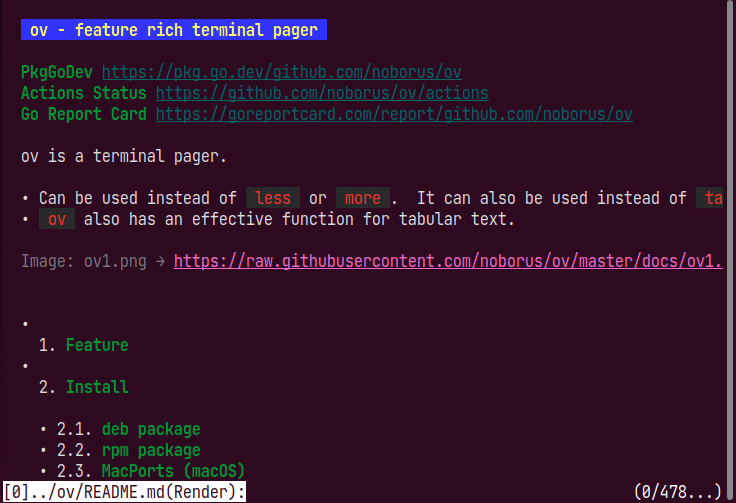

# mdviewer

This is a sample using the [ov(oviewer)](https://github.com/noborus/ov) package.



Start with `mdviewer markdownfile`.

```sh
mdviewer README.md
```

When started, [glamour](github.com/charmbracelet/glamour)
It is rendered and displayed in.

* Press the `]` key to see the original file.
* Press the `[` key to return.

See the [ov](https://github.com/noborus/ov) for other operations.